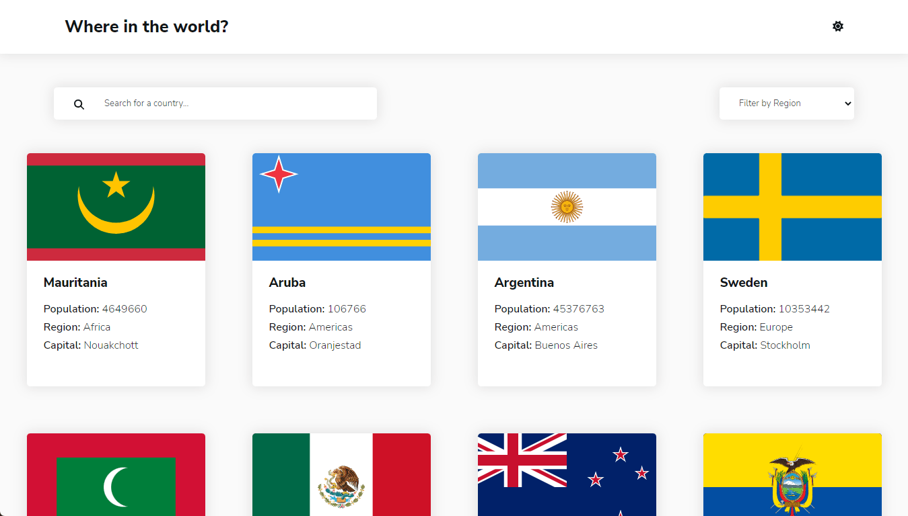

# Frontend Mentor - REST Countries API with color theme switcher solution

Countries app is a React JS app that pulls country information from the REST Countries API and displays it in an orderly and understandable way.

This is a solution to the [REST Countries API with color theme switcher challenge on Frontend Mentor](https://www.frontendmentor.io/challenges/rest-countries-api-with-color-theme-switcher-5cacc469fec04111f7b848ca). Frontend Mentor challenges help you improve your coding skills by building realistic projects. 

## Table of contents

- [Overview](#overview)
  - [The challenge](#the-challenge)
  - [Screenshot](#screenshot)
  - [Links](#links)
- [My process](#my-process)
  - [Built with](#built-with)
  - [What I learned](#what-i-learned)
  - [Continued development](#continued-development)
  - [Useful resources](#useful-resources)
- [Author](#author)
- [Acknowledgments](#acknowledgments)

## Overview

### The challenge

Users should be able to:

- See all countries from the API on the homepage
- Search for a country using an `input` field
- Filter countries by region
- Click on a country to see more detailed information on a separate page
- Click through to the border countries on the detail page
- Toggle the color scheme between light and dark mode *(optional)*

### Screenshot

### Links

- Solution URL: [Frontend mentor solution](https://www.frontendmentor.io/solutions/rest-countries-api-with-color-theme-switcher-GuP5EiQpx-)
- Live Site URL: [Live site](https://rest-countries-api-eddivalen.vercel.app/)

## My process

### Tasks to do:
- ~~Init project with create-react-app~~
- ~~Build countries component~~
- ~~Build header component~~
- ~~Build filter component~~
- ~~Add router and routes feature~~
- ~~Add SASS~~
- ~~Add environment variable~~
- ~~Add React Query~~
- ~~Add Dark/Light Switcher~~
- ~~Add loading spinner~~
- ~~Sort countries alphabetically~~
- Tooltip for theme switcher
- migrate create-react-app to Vite
- Add tests
### Built with

- Semantic HTML5 markup
- CSS Grid/Flex
- [SASS] (https://sass-lang.com/) - For styles
- [Font Awesome](https://fontawesome.com/) - For icons
- Mobile-first workflow
- [React](https://reactjs.org/) - JS library
- [React Router](https://reactrouter.com/) - For routing
- [React Query](https://react-query.tanstack.com/) - For fetching data

### What I learned

- How to effectively minimize the number of API requests made with React Query.
- Using React Query's caching feature has been a game-changer for managing the state of my app - it's much simpler and more efficient now.
- How to use React Context API and use persisted state to manage the state of the theme switcher.

Consider the following flow:
1. User visits the home page
2. User clicks on a country to view its details
3. User clicks on back button to return to home page
4. User clicks on a different country to view its details
5. User clicks on back button to return to home page
6. User clicks on a different country to view its details

Screenshot of API requests before using React Query:

Screenshot of API requests after using React Query:

As you can see, the number of API requests is incremental before using React Query. Without React Query a new API request is made every time the user visits the home or the country details page. After using React Query, the number of API requests has been reduced to 1. This is because React Query caches the data from the first API request, and uses it for the subsequent requests.

### Continued development

- Add loader to the app, and add tests.
- Implement react error boundaries to handle errors.
- Migrate create-react-app to Vite.

### Useful resources

- [How to build an app with React Query](https://www.commoninja.com/blog/how-to-build-an-app-with-react-query) - This helped me for understanding how to use React Query in order to fecth data and manage states.
- [Global Cached State in React using Hooks, Context, and Local Storage](https://medium.com/@akrush95/global-cached-state-in-react-using-hooks-context-and-local-storage-166eacf8ab46) - I found this article to be incredibly helpful in finally understanding how to use the Context API and Local Storage to manage global state in React.

## Author

- Frontend Mentor - [@eddivalen](https://www.frontendmentor.io/profile/eddivalen)
- Twitter - [@eddivalen](https://www.twitter.com/eddivalen)

## Acknowledgments

[Midudev](https://youtube.com/midudev) has been a great inspiration to me, his videos are packed with valuable information and he always motivates people by saying the phrase "A mover las manitas" which means "Let's get to work and make things happen!". I highly recommend you to check out his channel.
